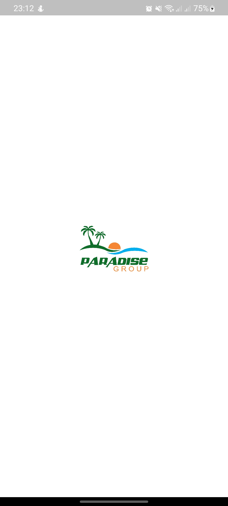
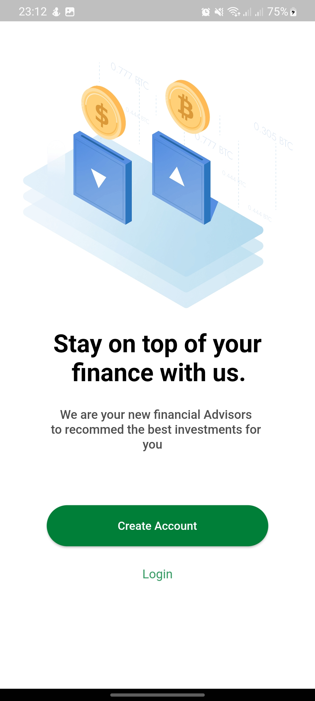
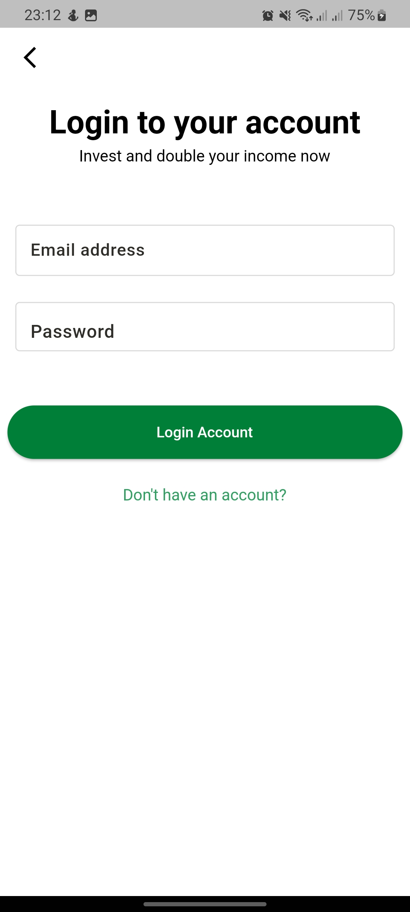

# mzizi_school_interview

A new Flutter project.

## Getting Started

This project is a starting point for a Flutter application.

A few resources to get you started if this is your first Flutter project:

- [Lab: Write your first Flutter app](https://docs.flutter.dev/get-started/codelab)
- [Cookbook: Useful Flutter samples](https://docs.flutter.dev/cookbook)

For help getting started with Flutter development, view the
[online documentation](https://docs.flutter.dev/), which offers tutorials,
samples, guidance on mobile development, and a full API reference.

## How to run the App
1. Clone this project.
2. Open with your favorite tools editor.
3. Run `Pub get` on each module sequentially starting from `dependencies`, `core`, and `your root project` to generated `pubspec.lock` file.
4. Add your `ip address` into ***fetch data*** file. 

# Screenshots
- Projects starts from the splash screen and goes to the create account screen
  
  
   | |  |  |  |
